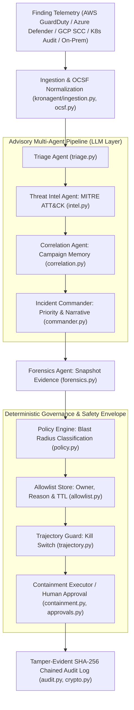

# Kronagent

**Autonomous AI threat-defense for enterprise networks — with guardrails you can audit.**

Kronagent is an AI-native security platform built as a team of specialist agents: it ingests live findings from multi-cloud and cluster environments, triages and investigates them, synthesizes an incident assessment, preserves forensic evidence, and executes containment — with **graduated autonomy**, not blanket automation. Every decision is gated by a deterministic policy engine, every action is planned and logged before it runs, destructive actions always wait for a human, and the entire trail is a tamper-evident, hash-chained audit log.

Most "AI SOC" tools stop at investigation. Kronagent executes — but only as much
autonomy as it has earned.

```bash
./demo.sh          # see it work, end to end, in your terminal
```

---

## Why it's built this way

The pitch for autonomous security response is easy; the trust model is the
hard part. Kronagent's answer is **earn-trust, graduated autonomy**:

- **Safe by default.** On a cold start, the auto-execute allowlist is empty.
  Every containment action requires human approval until an operator
  explicitly promotes it — and that promotion is itself audited (who, when,
  why).
- **Trust is re-earned, not inherited.** A promotion can carry a TTL
  (`--expires-in 90d`) and names an **owner** — the person accountable for it
  now, asked to renew it, and reassignable as people change teams (distinct
  from the immutable record of who promoted it and why). When the TTL lapses
  the class routes back to human approval, and the lapse is recorded in the
  audit chain like any other governance decision. The expiry, not the review,
  is what does the work: **a review fails open — silence reads as approval —
  while an expiry fails closed**, so inattention withdraws autonomy instead of
  extending it. (Badge permissions on regulated sites are built the same way:
  an owner and an expiry, and it's the expiry that carries the weight.)
  `promote.py review` is the prompt, not the control — it prints each entry
  with its owner, original reason, and whether it has ever actually fired, and
  `promote.py warn-expiring` (cron) tells each owner once, ahead of time, that
  theirs is about to lapse. Neither can keep an entry alive; if the warning
  never arrives, the entry still expires on schedule.
- **The policy engine is the hard ceiling, not a suggestion.** Actions are
  classified by reversibility and blast radius. Destructive or wide-blast
  actions (terminate an instance, delete a pod, scale a deployment to zero)
  are *structurally* incapable of running unattended — promoting one to the
  allowlist by mistake has no effect; the classification table wins.
- **LLMs reason, they never act.** Every agent's output schema is
  constructed so it cannot express a containment target or action class.
  Targets always come from the normalized finding data, never from a model —
  so a prompt-injection payload in telemetry cannot redirect an action onto
  an attacker-chosen resource.
- **Nothing is invisible.** Every decision — triage, policy, containment,
  approval, governance, forensics — is one entry in an append-only,
  SHA-256-chained audit log. Editing a past record breaks verification of
  every record after it. This is what makes an autonomous response
  defensible instead of a black box (and maps directly onto EU AI Act
  Article 12 automatic logging and Article 14 human oversight).

See [`agent-team-architecture.md`](agent-team-architecture.md) for the full
design rationale.

---

## The agent team

| Agent | Type | Role |
|---|---|---|
| **Triage** | LLM | Is this finding a real, actionable threat? |
| **Threat Intelligence** | LLM | Maps the finding to MITRE ATT&CK; assesses indicators of compromise |
| **Investigation / Correlation** | LLM, with memory | Is this part of a larger campaign? Correlates against recent findings |
| **Incident Commander** | LLM | Synthesizes the above into one narrative, a priority (P1–P4), and an escalation decision |
| **Forensics** | Deterministic | Preserves evidence (EBS snapshots, pod logs/manifests) with chain of custody — *before* containment can destroy it |

Every LLM agent is purely **advisory**: it enriches the incident record and
the human's approval context, and never touches the policy decision. Only two
layers can cause a side effect — the deterministic **policy engine** (decides
whether an action may run) and **containment** (executes it, or doesn't).




---

## What it actually does

- **Multi-provider detection.** Five substrates — AWS (GuardDuty — IAM/EC2),
  Azure (Defender for Cloud — VMs/Entra ID), GCP (Security Command Center —
  service accounts/Compute), Kubernetes (audit events — pods/nodes/deployments)
  and in-house/on-premises (hosts/accounts/processes) — normalize into one
  provider-neutral `Finding` type and flow through the identical pipeline.
  Adding another source is a new module in `kronagent/providers/` plus a
  registry entry; nothing above that seam changes. Because on-premises
  infrastructure has no vendor schema to normalize, that provider defines a
  small **ingestion contract** instead, and detectors (Wazuh, Falco, Suricata,
  syslog) map onto it.
- **Live ingestion.** GuardDuty → EventBridge → SQS, long-polled with
  at-least-once, ack-after-process delivery — a crash mid-processing
  redelivers the finding rather than losing it.
- **Real containment, planned before it runs.** Every action — disable an
  IAM key, isolate an instance/pod, block an IP, cordon a node — computes its
  exact API calls and rollback plan first, always, whether it executes,
  waits for approval, or is blocked.
- **Human approval that happens before the side effect**, not a retrospective
  log — reviewed with the full context (triage verdict, ATT&CK mapping,
  campaign correlation, evidence collected) and executed through the same
  path an autonomous action would take.
- **Governance with an audit trail.** Promoting an action class to
  autonomous execution is a CLI command, not an environment-variable edit —
  it's persisted, takes effect immediately (no restart), and is
  hash-chained into the audit log.

---

## Quickstart

```bash
python3 -m pip install -r requirements.txt
cp .env.example .env        # add GEMINI_API_KEY for LLM-enriched triage (optional — degrades gracefully)

python3 run_slice.py                                   # replay both providers' sample findings
python3 run_slice.py kubernetes samples/k8s_audit_events.json   # replay one provider

python3 run_preflight.py                                # is this deployment safe to arm?
python3 promote.py list                                 # inspect the auto-execute allowlist
python3 promote.py review --by alice                    # periodic re-earn-it review (--strict for cron)
python3 promote.py warn-expiring --dry-run              # who'd be warned that their entry is lapsing
python3 approve.py list                                 # inspect pending human approvals
python3 run_compliance_report.py                        # generate EU AI Act Article 12/14 report
python3 run_compliance_report.py --markdown-output rep.md # export a styled Markdown manifest

```

Everything above runs in **dry-run** by default (`KRONAGENT_DRY_RUN=true`) — no
cloud or cluster is touched. Findings are read from `samples/` with no AWS
account required.

### Live terminal demo

```bash
./demo.sh                        # interactive — press Enter between acts
KRONAGENT_DEMO_AUTO=1 ./demo.sh       # hands-off — auto-advances (for recording)
```

A five-act narrated walkthrough driving the **real CLIs**, no mocks: safe
defaults → cross-provider detection with graduated autonomy → earning trust
live (no restart) → human approval before execution → tamper-evident audit
(including a live tamper-detection demonstration). If the local SQS testbed
is installed, it also runs the *live* async ingestion path against a real
queue.

### Live SQS ingestion — no AWS account needed

```bash
python3 -m pip install -r testbed/requirements.txt
python3 testbed/sqs_emulator.py serve            # starts a local SQS emulator + streams sample findings in

# in another shell, using the endpoint/queue URL it prints:
export KRONAGENT_SQS_ENDPOINT_URL=http://localhost:5001
export KRONAGENT_SQS_QUEUE_URL=<printed queue URL>
python3 run_slice.py                             # long-polls and processes findings live
```

See [`testbed/README.md`](testbed/README.md) for the full setup, including the
Docker/ElasticMQ alternative and the reasoning behind choosing moto over
LocalStack.

### Governance — promoting an action class to autonomy

```bash
python3 promote.py add disable_access_key \
  --by alice --reason "30 days incident-free; reversible, single-credential blast radius"

python3 run_slice.py    # disable_access_key now auto-executes (still dry-run); destructive actions stay gated
```

### Approving a gated action

```bash
python3 approve.py list
python3 approve.py approve <request-id> --by alice --reason "confirmed compromise; isolate for forensics"
```

### Going live against real infrastructure

```bash
export KRONAGENT_DRY_RUN=false
export KRONAGENT_QUARANTINE_SG_ID=sg-...        # required for EC2 isolation
export KRONAGENT_QUARANTINE_NACL_ID=acl-...      # required for BLOCK_IP (EC2 Network ACL)
export KRONAGENT_DB_PATH=kronagent.db               # optional: sqlite database for persistent store/memory
export KRONAGENT_KUBECONFIG=/path/to/kubeconfig # required for Kubernetes containment
export KRONAGENT_SQS_QUEUE_URL=https://sqs...   # your real GuardDuty -> EventBridge -> SQS queue
```

Only action classes present *and unexpired* in the (audited, `promote.py`-managed) allowlist — and classified reversible/single-resource by the policy engine — will ever execute unattended. Expiry is enforced by the same read the policy engine makes on every decision, so a lapsed promotion stops granting autonomy immediately, whether or not anything has swept the store; the sweep only writes the lapse into the audit chain. **Before you flip `KRONAGENT_DRY_RUN=false`, run the pre-flight.** It is the one
command that answers "is this deployment actually safe to arm", and it fails
loudly on the misconfiguration that is invisible in dry-run: an action class
that is allowlisted or approvable but has no quarantine target configured. In
dry-run that unset value renders into the planned API call as a placeholder and
is never sent; live, the call goes out malformed, and you find out mid-incident.

```bash
python3 run_preflight.py            # 0 ready · 1 warnings · 2 fix before arming
python3 run_preflight.py --json     # for a deploy gate or container start check
```

Two things belong in cron:

```bash
0 9 * * *   python3 promote.py warn-expiring          # tell each owner once, before it lapses
0 9 * * 1   python3 promote.py review --strict        # weekly: exit 3 if anything needs a decision
```

The warning is notice, not control: if Slack is unconfigured or the send fails, the attempt is still audited and the entry still expires on time. Everything else routes to `approve.py` regardless of `KRONAGENT_DRY_RUN`. Persistent storage can be enabled by specifying `KRONAGENT_DB_PATH` pointing to a SQLite database file, transitioning the approvals queue and correlation memory from file-based/in-memory scopes. See [`deploy/README.md`](deploy/README.md) for the AWS IAM policy and SQS/EventBridge wiring.

---

## Project layout

```
kronagent/
  model.py            provider-neutral Finding / ResourceRef
  schemas.py           action taxonomy, triage/policy/outcome/audit types
  providers/
    __init__.py         registry: normalizers, planners, containment adapters
    aws.py              GuardDuty normalization + IAM/EC2 containment
    azure.py            Defender for Cloud normalization + VM/Entra containment
    gcp.py              SCC normalization + service-account/Compute containment
    k8s.py               Kubernetes audit normalization + pod/node containment
    onprem.py           in-house detector contract + host/account/process containment
  triage.py            deterministic action-mapping + LLM triage
  intel.py             Threat Intelligence Agent (MITRE ATT&CK)
  correlation.py       Investigation / Correlation Agent (+ campaign memory)
  commander.py         Incident Commander Agent (synthesis + escalation)
  forensics.py         Forensics Agent (evidence + chain of custody)
  policy.py            graduated-autonomy decision engine
  trajectory.py        behavioral-trajectory guard (automatic kill switch)
  allowlist.py         audited, live-reloadable earn-trust store (TTL + usage tracking)
  containment.py       provider-agnostic execution dispatch
  approvals.py         human approval workflow (supports SQLite/JSON)
  audit.py             hash-chained, tamper-evident audit log
  identity.py          operator identity + RBAC (local & OIDC providers)
  sanitization.py      prompt-injection sanitization for LLM-facing copies
  crypto.py            KMS/RSA signing for custody + agent non-repudiation
  ocsf.py              OCSF normalization for SIEM export
  chatops.py           Slack/Teams approval notifications
  compliance.py        EU AI Act compliance reporting engine
  ingestion.py         file replay + live SQS ingestion
  web.py               analyst console REST/UI
  config.py            all safety-critical settings (fail-safe defaults)

run_slice.py           runnable entry point
promote.py             earn-trust governance CLI
approve.py             human approval CLI
halt.py                kill-switch CLI (status / engage / clear a halt)
operators.py           operator registry admin CLI (identity bootstrap)
run_console.py         analyst web console server
run_eval.py            measured evaluation harness
run_siem_export.py     OCSF SIEM exporter
run_cloud_drill.py     cloud containment chaos/rollback drill
run_drift_check.py     continuous red-team drift simulation
run_compliance_report.py  compliance reporting CLI
demo.sh                narrated live terminal demo
demo_trajectory.py     adversarial trajectory-guard walkthrough

testbed/               local SQS emulator (no AWS account, no Docker)
deploy/                IAM policies, EventBridge/SQS wiring docs
samples/                real-schema sample findings (AWS, Azure, GCP, K8s, on-prem)
tests/                 602 tests, offline, ~23s
```

---

## Testing

```bash
python3 -m pip install -r requirements-dev.txt
python3 -m pytest -q
```

554 fully offline, deterministic unit and integration tests passing cleanly. Coverage highlights: the policy engine's safety ceiling (destructive actions proven to never auto-execute, even if allowlisted), the audit log's tamper-evidence (mutation-tested, not just asserted), the behavioral-trajectory guard (scope integrity, runaway rate, and latching — all with injected clocks rather than sleeps), a **cross-provider scope invariant** asserting that every planned action, for every provider, targets a resource its finding actually implicates (mutation-tested against a real defect this caught in the GCP planner), the approval-provider round-trip, forensics-before-containment ordering (mutation-tested), live ingestion against a real SQS server, SQLite-backed storage persistence, and EU AI Act compliance report generation.

---

## Documentation

- [`docs/use-cases.md`](docs/use-cases.md) — three findings end to end: what responding by hand looks like, what Kronagent does, and where it stops and waits for you
- [`agent-team-architecture.md`](agent-team-architecture.md) — why each agent is (or isn't) an LLM, and the safety envelope every agent operates inside
- [`deploy/README.md`](deploy/README.md) — IAM policy, EventBridge/SQS wiring for a real AWS deployment
- [`testbed/README.md`](testbed/README.md) — local SQS emulation, and why moto over LocalStack
- [`SECURITY.md`](SECURITY.md) — vulnerability reporting

---

## Status

This is a fully functional, enterprise-ready vertical slice:
- **Core Agent Team & Advisory Pipeline**: Triage, Threat Intel (with MITRE ATT&CK & STIX feed matching), Campaign Correlation, Incident Commander, and Deterministic Forensics.
- **Five Ingestion Substrates**: AWS (GuardDuty/IAM/EC2), Azure (Defender for Cloud/VMs/Entra ID), GCP (Security Command Center/IAM Service Accounts/Compute VMs), Kubernetes (API Audit/NetworkPolicy/Nodes), and in-house/on-premises (hosts, accounts, processes). All five ingest, normalize, plan and gate through one pipeline; live-execution depth varies by provider — see the table below.
- **Graduated Autonomy & Governance**: Deterministic policy engine, live-reloadable allowlist store, ChatOps (Slack Block Kit & Webhooks), and RBAC/OIDC SSO authentication.
- **Behavioral-Trajectory Guard**: A deterministic automatic kill switch over Kronagent's *own* action stream — scope-integrity enforcement (an action may only target a resource its finding implicates) plus a runaway-rate limiter that latches a platform-wide halt. The halt is **persisted**, so it survives a process restart rather than being silently released by one, and is released only by an audited, admin-gated `halt.py clear` — which a running orchestrator observes immediately, with no restart.
- **Enterprise Isolation & Web Console**: Multi-tenant business-unit isolation, single-page Analyst Web Console (`run_console.py`), and OCSF SIEM exporter (`run_siem_export.py`).
- **Security & Integrity**: Cryptographic agent-to-agent non-repudiation signatures, `Permission.VIEW` REST endpoint access control, target-preservation sanitization, and continuous chaos rollback validation (`run_cloud_drill.py`).
- **Test Suite**: 554 fully offline, deterministic unit and integration tests passing cleanly.

### Live containment execution by provider

Every provider ingests, normalizes, plans and policy-gates identically. What
differs is how much has been wired to real APIs:

| Provider | Live execution | Validated against real infrastructure |
|---|---|---|
| Kubernetes | All action classes | ✅ Kind + Calico cluster, traffic provably blocked |
| AWS | All action classes | ❌ Not yet run against a real account |
| GCP | All action classes (simulated state transitions) | ❌ |
| On-premises | All four action classes | ❌ Requires a configured control-plane URL |
| Azure | `deallocate_vm` only — NSG isolation and Entra ID actions raise `NotImplementedError` rather than guess at NIC resolution or Graph consent | ❌ |

---

---

## Production Readiness & Category Positioning

While major competing 2026 AI SOC tools (**Dropzone AI**, **Prophet Security**, **Torq HyperSOC**) stop at investigation and hand verdicts back to analysts, Kronagent executes **autonomous containment** with an **earn-trust governance framework**.

### The 7 Core Production Gaps

1. **Packaging & Deployment**: Production Dockerfile, docker-compose, Kubernetes Helm charts, and CI/CD pipelines.
2. **Cloud Onboarding**: 3-click AWS CloudFormation stack launch with STS `ExternalID` and separate Read-Only vs. Containment IAM role grants.
3. **Multi-Tenancy & Persistence**: Migration from SQLite flat files to PostgreSQL / DynamoDB with schema/row isolation and Redis campaign caching.
4. **Distributed Scalability**: Event-driven worker cluster (Celery/Temporal/SQS) with dead-letter queues and telemetry sanitization against prompt injection.
5. **Enterprise Security & KMS**: OIDC/SAML SSO, AWS KMS / Vault audit signing, SIEM export, and SOC 2 Type II audit window.
6. **Modern Web Console**: Next.js / React console with WebSockets / SSE for real-time finding feeds and interactive campaign graphs.
7. **Shadow Mode & Evaluation**: Benchmark evaluation harness measuring precision/recall and passive "shadow mode" customer trials.

---

## Phased Production Roadmap

| Phase | Target | Key Deliverables |
|---|---|---|
| **Phase 0: Containerization & CI/CD** | Installable Package | Dockerfile, docker-compose, GitHub Actions CI workflow, boot config validation, defect fixes. |
| **Phase 1: Cloud Connect & Onboarding** | Self-Serve Onboarding | CloudFormation launch-stack URL, STS ExternalID assume role, Read/Write role separation, preflight permission checker, onboarding UI. |
| **Phase 2: Database & Worker Architecture** | Enterprise Engine | Async worker queue (Celery/SQS), PostgreSQL + Alembic migrations, Redis campaign store, prompt injection sanitization layer. |
| **Phase 3: Modern Web UI & Real-Time SSE** | Production UX | React/Next.js console, WebSocket/SSE live alerts, interactive campaign graph, governance dashboard. |
| **Phase 4: Enterprise Auth & KMS Signing** | Security & Compliance | OIDC/SAML SSO, AWS KMS / Vault audit signing, audit export to SIEM, SOC 2 Type II audit window. |
| **Phase 5: Shadow Mode & Private Beta** | Market Launch | Eval harness benchmark report, shadow mode customer trials, commercial billing & GA rollout. |

For the complete architectural design and safety envelope rationale, see [`agent-team-architecture.md`](agent-team-architecture.md) and [`docs/use-cases.md`](docs/use-cases.md).

---

## Licence

Kronagent is **source-available, not open source**.

You may read, study, fork and modify this code for **noncommercial** purposes.
Commercial use — including offering it to third parties on a hosted or embedded
basis — requires a separate licence.

See [`LICENSE`](LICENSE) (PolyForm Noncommercial 1.0.0) for the full terms.
Commercial licensing: **licensing@kronagent.com**

Copyright (c) 2026 Aditya Kumar, trading as Kronagent · [kronagent.com](https://kronagent.com)
