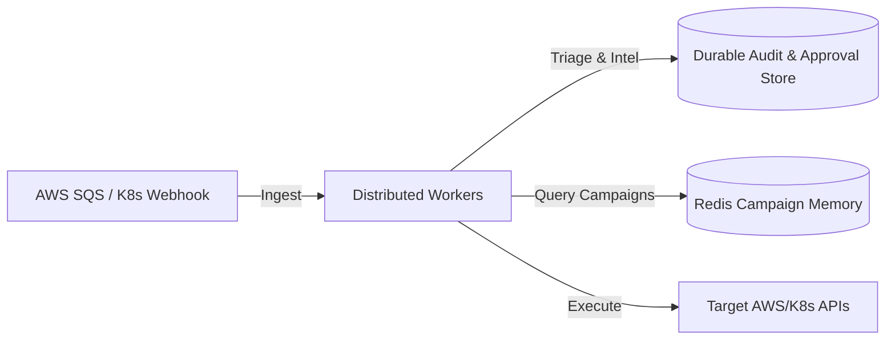

# Kronagent — From Pipeline to Agent Team: Architecture Research

*Compiled 2026-07-18. Grounded in live research (2026 industry + academic
sources, cited). This doc is the technical architecture for "a security team of
AI agents."*

---

## 0. The honest starting point

The pitch has always been "a cybersecurity team of AI agents." **What we've
actually built is a pipeline with one LLM call.** That's not a criticism — it's
the right foundation — but we should be precise about the gap before designing
the team:

| Stage | What it is today | Is it an "agent"? |
|---|---|---|
| Triage | One Gemini call (structured output) reasoning about a normalized finding | **Partially** — one reasoning step, no autonomy over what it does next |
| Containment planning | Deterministic per-provider planner (`plan_aws_actions`, `plan_k8s_actions`) | No — pure code, no reasoning |
| Policy / approval / audit | Deterministic engine + human loop | No, by design (and correctly so) |

So the real question isn't "should we add agents" — it's **which stages genuinely
benefit from agentic reasoning, and which must stay deterministic for safety.**
Getting that line right is the whole game. The failure mode to avoid is
*multi-agent theater*: spinning up six LLM calls that look like a team in a
diagram but add latency, token cost, and failure surface without adding
capability.

---

## 1. The industry-consensus agent roster (2026)

Three independent sources — [EY](https://www.ey.com/en_in/insights/ai/agentic-soc-multi-agent-orchestration-for-next-gen-security-operations),
[Torq](https://torq.io/blog/the-multi-agent-system-a-new-era-for-secops/), and the
academic [AgentSOC](https://arxiv.org/html/2604.20134v1) / [CORTEX](https://arxiv.org/pdf/2510.00311)
frameworks — converge on nearly the same specialized roster, organized in tiers:

**Core operational agents (real-time):**
- **Triage Agent** — filters false positives, assigns severity, automates 80–90% of Tier-1 alert load. *(We have this.)*
- **Threat Detection Agent** — behavioral anomaly + signature matching. *(This is upstream of us — GuardDuty/Falco already do it. We consume their output.)*
- **Response/Containment Agent** — endpoint isolation, credential revocation, etc. *(We have this, but deterministic — see §3 on why that's correct.)*

**Intelligence agents (investigation & strategy):**
- **Threat Intelligence Agent** — correlates IOCs with **MITRE ATT&CK** techniques, consumes STIX/TAXII feeds. *(We don't have this — highest-value gap.)*
- **Investigation / Correlation Agent** — is this finding part of a larger campaign? Correlates across findings, builds the incident narrative. *(We don't have this — findings are handled in isolation today.)*
- **Forensics Agent** — evidence collection, chain of custody. *(We don't have this; our audit log is adjacent but not the same thing.)*

**Orchestration layer:**
- **Orchestrator / Planner Agent** — decomposes a complex incident into subtasks, routes to specialists, resolves disagreement (majority vote / structured debate), and signals for human handoff on high-impact decisions.

**Universal finding across all sources:** human escalation is *mandatory* for
high-impact decisions, and the EU AI Act classifies this as high-risk (transparency
+ human oversight required). **This is exactly the earn-trust + audited-approval
model Kronagent already implements** — so the agent team must be built *inside* that
governance envelope, not around it.

---

## 2. The load-bearing design rule: not every agent is an LLM

The single most important architectural decision, and where most "agentic"
products go wrong: **an agent is a role with a goal and the autonomy to pursue it —
not necessarily an LLM call.** Kronagent's existing insight (LLM for judgment,
deterministic code for targets and execution) is *more* defensible than the pure
multi-agent-LLM designs, and it's a security property, not just an optimization:

> The LLM reasons *about* a detection; it never selects the concrete resource a
> containment action targets. So a prompt-injection payload in telemetry cannot
> redirect an action onto an attacker-chosen resource.

The rule that follows:

| Give an agent LLM reasoning when… | Keep an agent deterministic when… |
|---|---|
| The task is open-ended judgment: "is this a real threat," "is this part of a campaign," "what does this IOC correlate to" | The task has a correct answer computable from data: "which resource does this finding implicate," "is this action reversible" |
| Errors are caught downstream (a wrong triage verdict still routes to human approval) | Errors are unrecoverable or safety-critical (executing on the wrong resource) |
| The input is structured/enriched (post-normalization) | The input is untrusted raw telemetry (prompt-injection surface) |

**Every LLM agent added is new prompt-injection surface.** A multi-agent team that
passes untrusted telemetry through six LLM calls has six times the injection
exposure. The mitigation — already in our triage design — is to let LLMs reason
over *normalized, structured* findings and never let their output choose a target
or an action class directly.

---

## 3. Target architecture: a hybrid agent team inside the governance envelope

```
   Normalized Finding (from provider adapters — deterministic)
              │
              ▼
   ┌─────────────────────── ORCHESTRATOR AGENT ───────────────────────┐
   │  Decomposes the incident, routes to specialists, assembles the    │
   │  incident narrative, decides when to escalate to a human.         │
   └───────┬───────────────┬────────────────┬─────────────────────────┘
           │               │                │
           ▼               ▼                ▼
   ┌──────────────┐ ┌──────────────┐ ┌──────────────────┐
   │ TRIAGE AGENT │ │ THREAT-INTEL │ │ INVESTIGATION /  │   ← LLM agents
   │ (have it)    │ │ AGENT        │ │ CORRELATION AGENT│     (judgment)
   │ threat? sev? │ │ MITRE map,   │ │ campaign? related│
   │              │ │ IOC enrich   │ │ findings?        │
   └──────────────┘ └──────────────┘ └──────────────────┘
           │               │                │
           └───────────────┴────────────────┘
                           ▼
   ┌───────────────────────────────────────────────────────────────┐
   │  CONTAINMENT PLANNER  (deterministic, per-provider)            │  ← code
   │  targets from the finding, never from an LLM                   │
   └───────────────────────────────────────────────────────────────┘
                           ▼
   ┌───────────────────────────────────────────────────────────────┐
   │  POLICY ENGINE → APPROVAL → AUDIT   (deterministic + human)    │  ← the
   │  graduated autonomy, earn-trust, hash-chained log             │     envelope
   └───────────────────────────────────────────────────────────────┘
```

The three deterministic layers at the bottom are the ones that already exist and
carry the whole safety/compliance story. The agent team plugs in *above* them.
Crucially: **the agents enrich and reason; the deterministic envelope decides and
acts.** No agent, however many we add, can bypass the policy gate.

---

## 4. What to actually build, in priority order

Each step adds one real capability and is independently valuable — no big-bang
multi-agent rewrite.

1. **Threat Intelligence Agent (highest value, well-bounded).** Map each finding
   to MITRE ATT&CK tactics/techniques, enrich IOCs (is this IP/hash known-bad?).
   This is what turns "an alert" into "an analyst's assessment," and it's a bounded
   LLM task with a structured output — the same shape as triage. Directly upgrades
   the incident record and the approval context a human sees. *No new execution
   authority, so low risk.*

2. **Investigation / Correlation Agent.** Today every finding is handled in
   isolation. Real incidents are campaigns — the credential-exfil finding and the
   crypto-mining finding an hour later may be the same actor. This agent correlates
   across the audit history and asks "is this related to something we've already
   seen." Needs memory/state (supported by both session-scoped rolling in-memory window and durable SQLite-backed correlation database store), and it's where
   multi-agent genuinely beats single-call triage.

3. **Orchestrator Agent.** Only worth building *after* there are ≥2 intelligence
   agents to coordinate — otherwise it's overhead. Decomposes an incident, decides
   which specialists to invoke, assembles their outputs into one narrative, and
   decides human-escalation. This is where the "team" becomes real.

4. **Forensics Agent (later).** Evidence snapshotting (EBS snapshot, pod memory
   capture, log bundle) with chain-of-custody into the audit log. High value for
   the compliance story, but gated on real execution being live first.

**Deliberately NOT agentifying:** containment planning and the policy/approval/audit
envelope. Those stay deterministic — that's the safety ceiling.

---

## 5. Risks, stated plainly

- **Prompt-injection surface scales with LLM-agent count.** Each agent that reads
  untrusted telemetry is an injection target. Mitigation: agents reason over
  *normalized* findings; agent output never selects a target or action class
  (the existing triage discipline, applied to every new agent).
- **Cost and latency compound.** A 4-agent team is ≥4× the token spend and can be
  4× the latency if run serially. Mitigations: run independent agents in parallel
  (the architecture allows it); use the cheapest capable model per agent
  (`gemini-3.1-flash-lite` already chosen for triage); reserve expensive models for
  the orchestrator's synthesis step only.
- **Coordination failure modes.** Agents can disagree, loop, or cascade errors.
  Mitigations from the research: majority vote / structured debate for conflicts,
  hard iteration caps, and — critically — the deterministic policy gate as the
  backstop that no agent disagreement can bypass.
- **Multi-agent theater.** The temptation to add agents for the pitch deck rather
  than for capability. Discipline: every agent must add a capability a human analyst
  would recognize as a distinct job. If two "agents" could be one call, they're one
  call.

---

## 6. Current Status & Next Steps

The orchestrator and the multi-agent SOC team (Triage, Threat Intel, Correlation, Incident Commander, and Forensics) have been fully implemented, integrated, and verified end-to-end. Campaign memory and approvals are backed by persistent storage databases, and compliance manifests (for EU AI Act Articles 12/14) are generated automatically from the cryptographically verified audit log.

Moving forward, development is focused on the next architectural milestones:
- **Telemetry Pre-processing/Sanitization:** Implement validation layers to detect and strip potential prompt injection sequences from incoming alert telemetry.
- **Durable Infrastructure Testbed:** Deploy local cluster/cloud sandboxes (Kind/LocalStack) to validate active containment execution paths against running workloads.
- **KMS/HSM Cryptographic Signatures:** Harden the append-only audit log and forensic custody chains with hardware security module or KMS keys to establish an immutable, verifiable chain of custody.

---

## 7. Distributed Scaling & Enterprise Architecture

To run Kronagent in high-volume enterprise production environments, the architecture transitions from a single, sequential loop to a distributed, decoupled worker model:



### Architectural Pillars
*   **Decoupled Distributed Workers:** Long-polling ingestion processes run independently and push findings to task queues (e.g. Celery or custom Redis/SQS workers) to scale execution processing concurrently.
*   **Durable State Persistence:** Moves the operational stores (Approvals, Allowlists) and rolling correlation memories into shared state databases (such as DynamoDB/PostgreSQL and Redis/SQLite), preventing state synchronization issues across multiple cluster replicas.

---

## Sources

- [Agentic SOC: Multi-agent orchestration — EY](https://www.ey.com/en_in/insights/ai/agentic-soc-multi-agent-orchestration-for-next-gen-security-operations)
- [The Multi-Agent System: A New Era for SecOps — Torq](https://torq.io/blog/the-multi-agent-system-a-new-era-for-secops/)
- [AgentSOC: A Multi-Layer Agentic AI Framework for Security Operations — arXiv](https://arxiv.org/html/2604.20134v1)
- [CORTEX: Collaborative LLM Agents for High-Stakes Alert Triage — arXiv](https://arxiv.org/pdf/2510.00311)
- [Top 10 Agentic SOC Platforms for 2026 — Stellar Cyber](https://stellarcyber.ai/learn/top-10-agentic-soc-platforms/)
- [MITRE ATT&CK framework](https://attack.mitre.org/)
